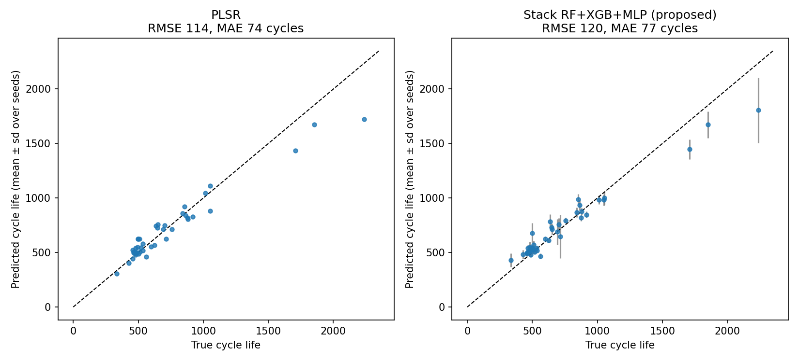
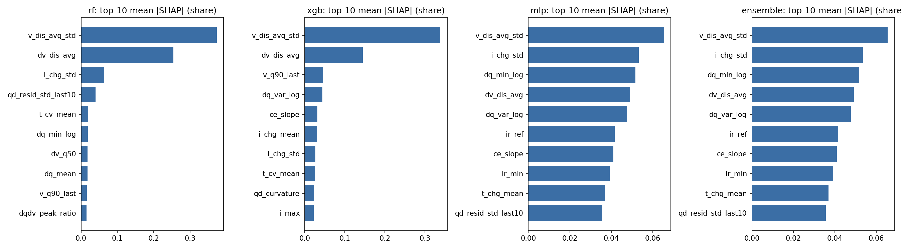

# Interpretable Stacked Ensemble Learning for Early-Life Battery Cycle-Life Prediction on the BatteryML MATR-1 Benchmark

A reproducible study, aligned with BatteryML and designed to avoid data leakage, of one question:

> **Can an interpretable, constrained stacked ensemble of Random Forest, XGBoost and an MLP, built on
> the first T cycles of a cell, predict battery cycle life on MATR-1 better than the individual models,
> simple ensembles and BatteryML baselines?**

**Short answer: no, not in a statistically or practically meaningful way.** The proposed stack beats
RF and XGBoost alone. It does **not** beat the best individual model chosen by cross-validation (PLSR), simple
averaging, or BatteryML's own PLSR-on-QdLinear baseline. The repository documents why. In short, the base learners make
highly correlated errors, all of them fail on long-lived cells, and simplex stacking weights fitted on 41 cells
are unstable. Every number below comes from the code in this repository and can be regenerated with
one command.

Primary reference framework: [microsoft/BatteryML](https://github.com/microsoft/BatteryML).
Dataset: MATR-1 only (Severson et al., *Nature Energy* 2019, as packaged by BatteryML).

---

## 1. Problem

Lithium-ion cells degrade at very different rates even under nominally similar use. Predicting a
cell's **cycle life** from its **first T cycles** enables early screening of cells and charging protocols.
The task here, one feature vector and one target per cell, is

$$X_i^{(1:T)} \;\rightarrow\; L_i ,$$

where $X_i^{(1:T)}$ contains only measurements from cycles 1…T (T = 100 in the main experiment) and
$L_i$ is BatteryML's cycle-life label: the cycle at which discharge capacity first falls to
0.8 × 1.1 Ah. Using one feature vector per cell, rather than predicting RUL at every cycle, removes the temporal-leakage risks of
sliding-window formulations and matches the BatteryML MATR benchmark.

## 2. Alignment with BatteryML

| Item | BatteryML | This repo |
|---|---|---|
| Data | `batteryml download/preprocess MATR` → `MATR_<cell>.pkl` | Same pickles, read directly (`batteryrul/io.py`); BatteryML need not be installed |
| Label | `RULLabelAnnotator` (EOL = 80 % SOH, min 100 cycles) | Line-for-line port (`batteryrul/labels.py`), unit-tested |
| MATR-1 split | `MATRPrimaryTestTrainTestSplitter`: 41 train / 42 test cells, b2c1 removed | Identical ids (`splits/train_cells.csv`, `splits/test_cells.csv`) |
| Features | Severson variance / discharge / full, QdLinear (`VoltageCapacityMatrixFeatureExtractor`) | Exact ports = **Feature Set A** (`batteryrul/features/batteryml_ref.py`) |
| Transforms | z-score features; log → z-score label | Same, fitted on training cells only |
| Metric | RMSE in cycles | RMSE plus 8 more metrics, 10 seeds, CIs, paired tests |

**Validation of the alignment: BatteryML's published MATR-1 baselines are reproduced** (`scripts/02_batteryml_baselines.py`):

| Model | Features | This pipeline | BatteryML published |
|---|---|---|---|
| Dummy | – | 398.8 | 398 |
| "Variance" model | ΔQ variance | 136.1 | 136 |
| "Discharge" model | expert | 329.0 | 329 |
| "Full" model | expert | 166.8 | 167 |
| Ridge | QdLinear | 115.8 | 116 |
| PCR | QdLinear | 123.1 | 90 † |
| PLSR | QdLinear | **103.7** | 104 |
| Gaussian process | QdLinear | 154.0 | 154 |
| XGBoost | QdLinear | 333.7 | 334 |
| Random forest | QdLinear | 173.5 ± 10.4 | 168 ± 9 |

† PCR with BatteryML's config (`n_components: 12`) is deterministic at 123.1 under every SVD solver.
The published 90 could not be reproduced and probably comes from a different config revision.

Documented deviations (all in Feature Sets B/C only; Set A keeps BatteryML's behaviour, quirks included):
BatteryML's "Average early charge time" actually integrates the **discharge** step (I < 0), so Set B
defines charge and discharge durations correctly. Set B/C also clean in-window logging artefacts
(IR = 0 on one batch-1 cycle; Qd spikes of 1.54 Ah and 2.88 Ah in b1c0 and b1c18).

## 3. Audit of the original implementation

Full details are in [`docs/AUDIT.md`](docs/AUDIT.md). In brief, the original notebook's **MATR-1 RMSE of 103.5 reproduces exactly**
(`scripts/audit_legacy_notebook.py`), but it is not a valid result:

* the label was `len(cycle_data)` (recorded cycles), not the BatteryML EOL label. It differs for all 83 cells (by +12 cycles on average, up to +36);
* a single untuned XGBoost configuration was scored only on the test set. 36 neighbouring configurations span
  101.5–178.0 RMSE on the same test cells;
* the same pipeline's grouped-CV RMSE on the training cells is ≈ 208. A single long-lived training cell (b1c1, 2160 cycles) cannot be
  predicted when held out, so the test RMSE of 103.5 understates the error on long-lived cells;
* RF, MLP and the ensemble named in the repository title did not exist, and HUST was mixed into an MATR study.

## 4. Experimental protocol

* **Splitting (Option B):** BatteryML's 42 test cells form a locked, untouched test set. The 41 training cells are
  split into **grouped, label-stratified 5-fold CV** (`splits/cv_folds.csv`), and every model and experiment uses the same folds.
  With one row per cell, each cell is its own group, so no cell is ever shared across partitions.
* **Leakage controls (all programmatic):**
  * `assert_disjoint` runs on every split, fold and feature matrix;
  * all features come from a `Window` object that slices the cache to cycles 1…T *before* any computation and refuses to
    return the label, the full capacity trajectory or the number of recorded cycles;
  * `tests/test_feature_leakage.py` corrupts every cycle after T, and the label, and asserts that all features are unchanged (A, B, C; T = 20/50/100; sparse windows);
  * winsorisation, imputation, scaling and the label transform sit inside an sklearn `Pipeline` that is re-fitted on
    the training part of every fold;
  * hyperparameters are chosen by repeated grouped CV (3 × 5 folds) on training cells;
  * ensemble weights are fitted only on out-of-fold (OOF) predictions of training cells;
  * the SHAP background comes from training cells, and explanations use held-out cells only.
* **Pre-registered selections (training CV only):**
  * best individual model = lowest OOF RMSE among Ridge/PLSR/RF/XGB/MLP;
  * final ensemble = the RF+XGB+MLP stack, unless the RF+XGB stack has lower cross-fitted CV RMSE, in which case the MLP is dropped;
  * main feature set = lowest CV RMSE of the final ensemble.
* **Seeds:** 10 seeds (0–9), as in BatteryML. Results are reported as mean ± std over seeds. 95 % CIs come from a cell bootstrap of the
  seed-averaged RMSE. Paired comparisons use a paired cell bootstrap and a Wilcoxon signed-rank test on per-cell absolute errors.

## 5. Features

Each feature has a formula, unit, source signal, window, interpretation and leakage note in
[`docs/FEATURE_DICTIONARY.md`](docs/FEATURE_DICTIONARY.md).

| Set | # | Content |
|---|---|---|
| **A** BatteryML reference | 12 | Severson ΔQ(V) min/variance/skewness/kurtosis, capacity fade fit, early "charge" time, temperature, internal resistance (IR) |
| **B** core physical | 30 | capacity level/retention/fade slopes, coulombic efficiency (CE) mean/std/trend, discharge voltage mean/variability/energy/quantiles, charge-current statistics, charge/discharge/CV durations, temperature, IR |
| **C** = B + trajectory | 46 | + fade acceleration, rolling slope/noise, ΔQ(V) statistics and L2 distance, voltage-quantile and mean-voltage drift, dQ/dV peak shift/attenuation, duration/IR/temperature trends |

## 6. Models and ensembles

Dummy · BatteryML baselines (Variance model, PLSR-QdLinear) · Ridge · PLSR · Random Forest · XGBoost ·
MLP (sklearn, 1–2 small hidden layers, early stopping on a split of the training data) · equal-weight average ·
validation-weighted average (w ∝ 1/OOF-MSE) · **constrained linear stack**

$$\hat L_{ens}=w_{RF}\hat L_{RF}+w_{XGB}\hat L_{XGB}+w_{MLP}\hat L_{MLP}+b,\qquad w_i\ge 0,\ \textstyle\sum_i w_i=1,$$

fitted by SLSQP on 5-fold OOF predictions. The base learners are then refitted on all 41 training cells and frozen.
Ablations: every 2-model stack, RF+XGB averaging, and an *exploratory* Ridge+RF+XGB+MLP stack (not part of
any selection).

## 7. Results

All results are on the 42 locked test cells, main configuration (selected by training CV): **Feature Set C, T = 100**.
Full tables are in [`results/REPORT.md`](results/REPORT.md); per-cell predictions are in `results/predictions/` and `results/runs/*/predictions.csv`.

### Experiment 1: main benchmark

| Model | RMSE (cycles) | 95 % CI | MAE | MedAE | R² | Bias |
|---|---|---|---|---|---|---|
| Dummy | 398.8 | [197, 566] | 239.0 | 139.3 | −0.07 | −100.4 |
| BatteryML Variance model | 136.1 | [109, 165] | 109.1 | 88.6 | 0.876 | −4.9 |
| **BatteryML PLSR (QdLinear)** | **103.7** | [72, 136] | 74.0 | 64.1 | 0.928 | −19.0 |
| Ridge | 127.2 | [66, 187] | 74.9 | 42.1 | 0.891 | −21.1 |
| PLSR (best individual by CV) | 113.9 | [65, 166] | 73.7 | 50.7 | 0.913 | −13.0 |
| Random forest | 166.4 ± 6.1 | [87, 242] | 93.3 | 46.8 | 0.814 | −25.1 |
| XGBoost | 151.1 ± 10.5 | [72, 226] | 84.9 | 48.3 | 0.846 | −20.2 |
| MLP | 111.7 ± 29.6 | [76, 148] | 73.6 | 46.3 | 0.911 | −14.4 |
| Equal-weight RF+XGB+MLP | 129.5 ± 14.0 | [66, 192] | 74.1 | 41.1 | 0.886 | −19.9 |
| Validation-weighted RF+XGB+MLP | 126.4 ± 17.8 | [67, 185] | 73.4 | 40.7 | 0.891 | −18.6 |
| **Stack RF+XGB+MLP (proposed, final)** | 120.4 ± 32.6 | [77, 165] | 77.1 | 46.3 | 0.896 | +3.4 |
| Stack Ridge+RF+XGB+MLP (exploratory) | 110.5 ± 21.8 | [72, 151] | 73.0 | 50.2 | 0.915 | +3.0 |

Paired test-set comparisons of the proposed stack (ΔRMSE < 0 favours the stack):

| vs | ΔRMSE | 95 % CI | Wilcoxon p | cells where stack is better |
|---|---|---|---|---|
| PLSR (best individual, CV) | +6.5 | [−6.7, +23.9] | 0.39 | 18/42 |
| MLP | +8.7 | [−6.6, +19.8] | 0.65 | 21/42 |
| Validation-weighted average | −6.0 | [−22.6, +15.6] | 0.14 | 16/42 |
| XGBoost | −30.7 | [−63.5, +8.8] | 0.62 | 21/42 |
| Random forest | **−46.0** | **[−80.8, −7.3]** | 0.56 | 22/42 |



### Experiment 2: feature ablation (T = 100, test RMSE)

| Model | Set A (12) | Set B (30) | Set C (46) |
|---|---|---|---|
| PLSR | 141.0 | 142.1 | **113.9** |
| Ridge | **123.2** | 152.0 | 127.2 |
| Random forest | 171.7 ± 7.2 | 183.7 ± 5.6 | **166.4 ± 6.1** |
| XGBoost | **134.7 ± 6.2** | 149.5 ± 16.7 | 151.1 ± 10.5 |
| Final ensemble (CV-selected) | 128.2 ± 43.5 (RF+XGB+MLP) | 179.0 ± 10.2 (RF+XGB) | 120.4 ± 32.6 (RF+XGB+MLP) |

On their own, the core physical features (B) were **worse** than BatteryML's 12 expert features (A) for every model.
Adding the trajectory and curve-shape features (C) recovered or improved accuracy for PLSR, RF and the stack, but not for XGBoost or Ridge.
The training-CV RMSEs of the three sets differ by less than 3 cycles, so feature engineering did not produce a clear, consistent gain.

### Experiment 3: ensemble ablation. Do the models make complementary errors?

| | RF | XGB | MLP | Ridge |
|---|---|---|---|---|
| OOF residual correlation with RF | 1 | 0.985 | 0.926 | 0.935 |

Residual correlations between all base models are **0.93–0.99**, so there is little complementarity to exploit.
The RF+XGB stack (159.2) is no better than XGBoost alone (151.1). Adding the MLP helps (120.4), but mostly by
shifting weight onto the MLP: mean weights are RF 0.28, XGB 0.17, MLP 0.55, b = +21 cycles. Weights fitted on 41 OOF residuals
are dominated by the single longest-lived training cell, and they jump between simplex corners across seeds
(for Feature Set A the MLP weight is ≥ 0.97 in 6 of 10 seeds and 0 in another). The stack therefore inherits the MLP's
seed variance (± 33 cycles). Equal and inverse-MSE averaging have the most stable weights (≈ ⅓ each) and the lowest
CV RMSE of all ensembles (211.5 and 206.7, vs 216.8–229.1 for the stacks).

### Experiment 4: how many cycles are needed? (Feature Set C, test RMSE)

| T | Dummy | PLSR | Proposed stack |
|---|---|---|---|
| 20 | 398.8 | 179.8 | 216.3 ± 21.1 |
| 50 | 398.8 | 137.7 | 126.6 ± 40.2 |
| 100 | 398.8 | 113.9 | 120.4 ± 32.6 |

Twenty cycles already remove more than half of the dummy error. Most of the remaining gain arrives by cycle 50.
At T = 20 the linear model is clearly better than the tree-based stack.

### Experiment 5: robustness of test inputs (ΔRMSE vs clean, 20 repeats × 10 seeds)

| Model | Gaussian noise (1 mAh, 5 mV) | 10 % missing | 20 % missing | every 5th cycle |
|---|---|---|---|---|
| Ridge | +33.8 ± 7.8 | +33.9 | +77.2 | −12.9 |
| PLSR | +44.3 ± 7.8 | +34.4 | +78.8 | −0.8 |
| Random forest | **+11.4 ± 6.2** | +36.8 | +102.8 | +53.0 |
| XGBoost | +49.3 ± 12.9 | +30.3 | +81.3 | +18.2 |
| MLP | +65.6 ± 43.0 | +33.4 | +83.7 | +23.1 |
| Proposed stack | +38.7 ± 28.5 | +32.3 | +88.7 | +30.4 |

Tree robustness is **condition-specific**. RF is the most robust to signal noise but the least robust to
20 % missing values and to sparse cycle sampling. The linear models are essentially unaffected by sparse sampling.

### Errors by cycle-life group (tertiles of training labels)

All models over-predict short-lived cells slightly and **under-predict long-lived cells heavily** (> 716 cycles; bias −63 for the MLP
to −154 for RF). Tree models cannot predict above the longest training life. This shared failure, not model diversity,
dominates RMSE on MATR-1.

## 8. SHAP interpretability (held-out cells)



* **Stable, physically plausible associations.** In both RF and XGBoost, across all 15 runs (10 seeds + 5 CV folds),
  the top features are the variability of the cycle-averaged discharge voltage over cycles 1–100 (`v_dis_avg_std`)
  and its drift from cycle 2 to cycle 100 (`dv_dis_avg`). Larger drift is associated with shorter life (learned
  sign − and + respectively, consistent with growing polarisation and resistance).
* **A protocol proxy.** `i_chg_std` (variability of the multi-step fast-charge current) is also consistently top-3. It describes the
  charging protocol, a design variable known in advance, rather than measured degradation. It is not leakage, but part of the
  predictive signal is protocol-to-life association, not degradation physics.
* **Consistent but unstable.** The Severson ΔQ(V) features (`dq_var_log`, `dq_min_log`) have the expected negative sign but appear in the top 10
  in only 40–47 % of tree runs, so they are not claimed as robustly important in this feature set (they are highly collinear
  with the voltage-drift features).
* Agreement between models' importance rankings is moderate (Spearman 0.42–0.50 between RF, XGB and MLP). No feature exceeds
  40 % of the ensemble's total |SHAP|, so no suspiciously dominant (possibly leaky) feature was found.
* Local cases (correct short-life b2c30, correct long-life b1c23, worst under-prediction b2c47, worst over-prediction b1c25)
  are in `results/figures/shap_local_cases.png`.

SHAP describes **associations the models learned**, not causal degradation mechanisms.

## 9. Conclusion

1. The pipeline is BatteryML-aligned and checked for leakage. It reproduces 8 of BatteryML's 10 sklearn MATR-1 baselines to within 1 cycle
   and Random Forest to within one seed standard deviation (PCR is the exception),
   and shows that the earlier 103.5 RMSE came from a non-standard label and a single configuration scored only on the test set.
2. **The constrained stack of RF, XGBoost and MLP does not significantly improve on the best individual model**
   (ΔRMSE +6.5 vs PLSR, 95 % CI [−6.7, +23.9]). It also does not improve on simple averaging or on BatteryML's PLSR-QdLinear baseline (103.7).
   It does significantly beat Random Forest alone (−46.0, CI [−80.8, −7.3]).
3. Why: the base models' errors are highly correlated (0.93–0.99), all models share a failure to extrapolate to long-lived cells,
   and with 41 training cells the OOF-fitted stacking weights are unstable.
4. Feature engineering beyond BatteryML's expert features gives mixed, model-dependent changes. Trajectory and curve-shape features help
   PLSR, RF and the stack but not XGBoost or Ridge.
5. About 50 early cycles carry most of the predictive information, and 20 cycles are clearly insufficient for tree models.
6. Robustness depends on the type of corruption: RF tolerates noise, linear models tolerate sparse sampling, and every model degrades with missing features.

## 10. Contribution statement

A reproducible, leakage-safe, BatteryML-aligned investigation of whether interpretable constrained stacking of
heterogeneous tabular models improves early-life battery cycle-life prediction on the MATR-1 benchmark. It includes
feature, model, ensemble, horizon and robustness ablations, and its answer is a well-characterised **negative result**:
with the available data, stacking did not provide practically meaningful gains over strong individual or linear baselines.

Suggested paper title: *"Does Constrained Stacking Help Early-Life Battery Cycle-Life Prediction? A Leakage-Safe,
BatteryML-Aligned Study on MATR-1."*

## 11. Limitations and future work

**Limitations.**
* Only 41 training and 42 test cells: CIs are wide and one long-lived cell (b1c1) dominates CV error.
* Hyperparameters were tuned once on all training cells and reused for OOF predictions (no nested CV). The test set is unaffected, but OOF errors are slightly optimistic.
* The BatteryML MLP/CNN/LSTM/Transformer baselines were not re-run (published values are quoted).
* PCR's published result could not be reproduced.
* MATR-1 contains one chemistry (LFP/graphite), one form factor and one lab, so no generalisation claim beyond it is made.

**Future work (out of scope here).**
* Target or model formulations that extrapolate in cycle life (e.g. monotone or linear-in-log models, quantile models).
* Robust stacking (regularised or shrinkage-to-equal weights, Huber loss) and nested CV.
* MATR-2 / secondary test batch.
* HUST and cross-dataset transfer, multi-chemistry and domain adaptation.
* Sequence models (LSTM/Transformer/CNN).

## 12. Reproducing everything

```bash
pip install -r requirements.txt
```

1. **Get the data**: produce the BatteryML-processed MATR pickles (only the 83 MATR-1 cells are read):
   ```bash
   pip install git+https://github.com/microsoft/BatteryML.git
   ```
   ```bash
   batteryml download MATR ./data/raw && batteryml preprocess MATR ./data/raw ./data/processed/MATR
   ```
2. **Run the whole study** (about 25 min on a laptop CPU):
   ```bash
   python run_all.py --data-dir ./data/processed/MATR
   ```
   or set `MATR_DIR`, or edit `configs/default.yaml`.
3. **Without the raw data**, rerun the models, SHAP and report from the committed feature matrices:
   ```bash
   python scripts/04_run_experiments.py && python scripts/06_shap.py && python scripts/07_make_report.py
   ```
4. **Kaggle**: open `notebooks/kaggle_run_all.ipynb`, attach a dataset containing the processed `MATR_*.pkl`, and run all cells.
5. **Tests** (split disjointness, label port, no-future-information features, stacker):
   ```bash
   python -m pytest -q
   ```

| Step | Script | Output |
|---|---|---|
| 0 | `scripts/00_build_cache.py` | `data/cache/*.npz`, per-cycle signals for cycles 1–100 |
| 1 | `scripts/01_make_splits.py` | `splits/*.csv`, `results/tables/labels.csv` |
| 2 | `scripts/02_batteryml_baselines.py` | BatteryML reproduction table and predictions |
| 3 | `scripts/03_build_features.py` | `results/features/features_{A,B,C}_T{20,50,100}.csv`, feature dictionary |
| a | `scripts/audit_legacy_notebook.py` | legacy-notebook audit tables |
| 4 | `scripts/04_run_experiments.py` | `results/runs/T*_*/` (tuning, predictions, weights, metrics, models), `main.json` |
| 5 | `scripts/05_robustness.py` | `results/runs/robustness/` |
| 6 | `scripts/06_shap.py` | `results/runs/shap/`, SHAP figures |
| 7 | `scripts/07_make_report.py` | `results/tables/table*.csv`, `results/figures/`, `results/REPORT.md` |

Committed results were produced with Python 3.12, the pinned `requirements.txt`, CPU only, on Windows 11.
Seeds, folds and the tuning seed are fixed in `configs/default.yaml`.

## Repository layout

```
batteryrul/            package: io, labels, splits, cache, features/, models, ensemble, experiment,
                       metrics, robustness, interpret
configs/default.yaml   every setting (paths, seeds, folds, search budgets, robustness levels)
scripts/               numbered pipeline steps + legacy audit
splits/                locked battery-level manifests
results/               features, runs (predictions, metrics, weights, models), tables, figures, REPORT.md
docs/                  AUDIT.md, FEATURE_DICTIONARY.md
notebooks/             kaggle_run_all.ipynb, legacy/ (original notebook, kept for the audit)
tests/                 leakage, label, split and ensemble tests
```

## References

* Severson, K. A. et al. Data-driven prediction of battery cycle life before capacity degradation. *Nature Energy* 4, 383–391 (2019).
* Zhang, H. et al. BatteryML: An open-source platform for machine learning on battery degradation. *ICLR* 2024. https://github.com/microsoft/BatteryML
* Lundberg, S. M. & Lee, S.-I. A unified approach to interpreting model predictions. *NeurIPS* 2017.
