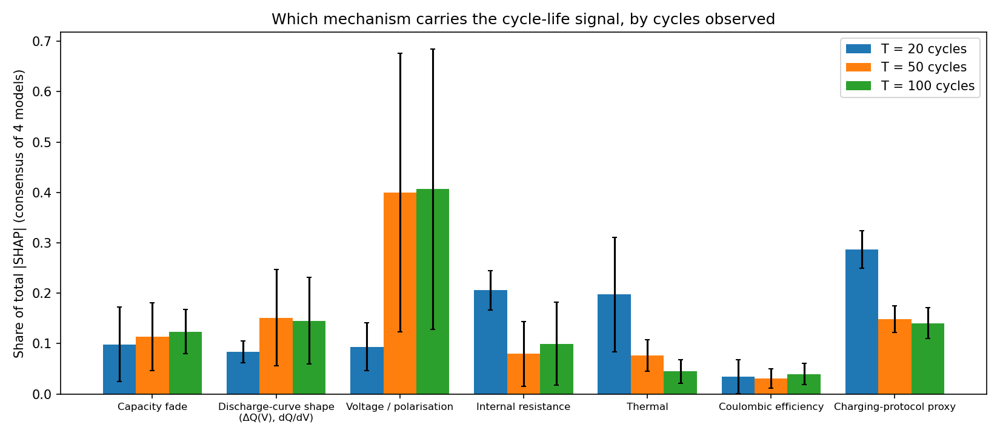
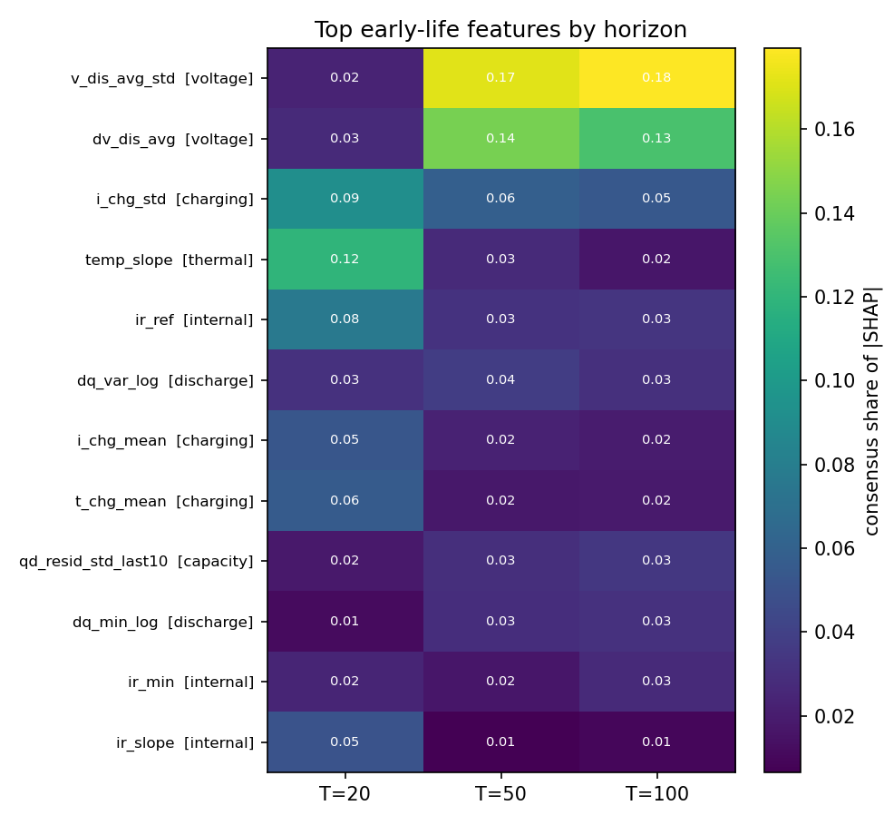
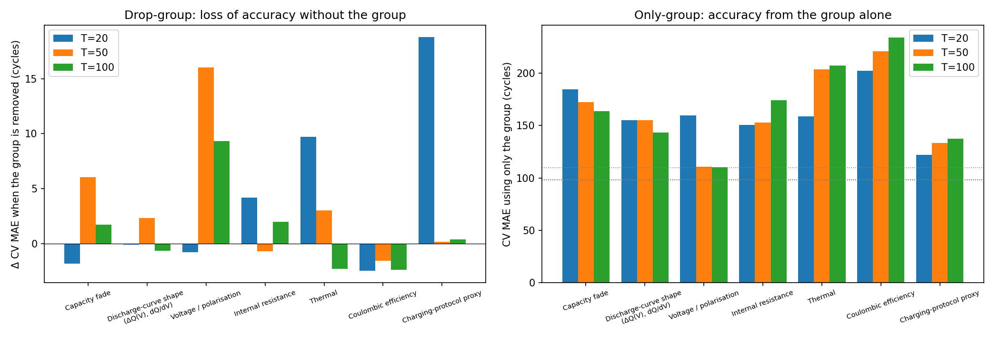
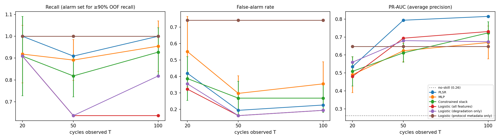
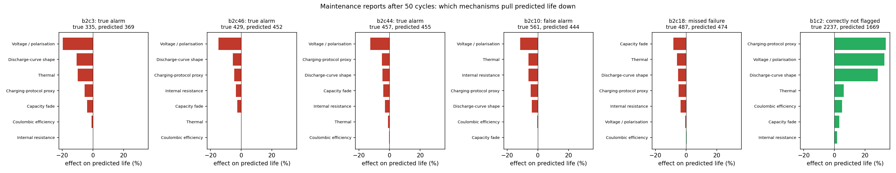

# Which Early-Cycle Signals Predict Premature Battery Failure?
### Interpretable early-life prognostics for predictive maintenance on the BatteryML MATR-1 benchmark

> **Research question.** Using as few early cycles as possible, can we tell **which measurable
> features signal that a lithium-ion cell will fail early**, and flag that cell for maintenance or replacement
> long before it degrades?

This repository answers that question on the [BatteryML](https://github.com/microsoft/BatteryML)
MATR-1 benchmark (Severson et al., *Nature Energy* 2019; 83 LFP/graphite cells, 41 train / 42 locked test).
It uses a pipeline that is designed to prevent data leakage and is reproducible bit-for-bit. Every number below is regenerated by
`python run_all.py`.

## Key findings

1. **The signal changes between cycle 20 and cycle 50.** After 20 cycles, the models rely mainly on the
   **charging protocol** (29 % of SHAP attribution), the cell's **initial resistance** (21 %) and its **temperature trend** (20 %).
   These describe how the cell is used and what state it started in, not degradation. After **50 cycles**, the dominant signal is
   **drift of the discharge-voltage curve** (polarisation, 40 %), with discharge-curve shape (ΔQ(V)) next (15 %).
   The picture at 100 cycles is essentially the same as at 50.
2. **The top early-failure indicators are stable and physically plausible.** The two most important features at T ≥ 50 are
   the cycle-to-cycle variability (`v_dis_avg_std`) and the drift (`dv_dis_avg`) of the mean discharge voltage.
   - They are top-10 in 92–98 % of the 51 explanation runs (PLSR 6, RF/XGBoost/MLP 15 each).
   - All 4 models agree on their sign: more voltage fade means shorter life.
   - This is consistent with growing overpotential and resistance.
3. **Retraining confirms the SHAP attributions.** Removing the voltage/polarisation group costs the most accuracy at T = 50
   (+16 cycles cross-validation MAE), and the group alone almost matches the full model. At T = 20, removing the protocol proxies costs the
   most (+19 cycles). From T = 50 onwards they can be removed at no cost (+0.2), so the degradation features alone are enough.
4. **Early-failure alarms work from 50 cycles.** Early failure here means a cycle life of 488 or less (the lower third of training lives).
   With an alarm threshold fixed on training cells, PLSR after 50 cycles caught **10 of 11** early failures
   with a **19 % false-alarm rate** (PR-AUC 0.79 vs 0.26 for guessing). After 20 cycles it catches all of them, but false-flags 42 % of healthy cells.
   The charging protocol alone catches every failure but false-flags **74 %** of healthy cells, so it cannot discriminate.
5. **Per-cell maintenance reports** say which mechanism pulled each flagged cell's predicted life down (e.g. b2c3:
   voltage/polarisation −20 %, discharge-curve shape −11 %). The false alarms are borderline cells (true life 495–561 cycles, just above
   the 488 threshold).
6. **Model choice matters less than the features.** A heavily tuned RF + XGBoost + MLP stack did **not** beat a simple
   linear PLSR model (Section 9). With 41 training cells, an interpretable linear model is as accurate as the ensemble and easier to explain.

**Claim boundary:** SHAP and ablation identify **early indicators associated with early failure** in this dataset.
They are not proof of a causal degradation mechanism. Mechanism labels such as "polarisation" are physically motivated hypotheses.

---

## 1. Data and BatteryML alignment

| Item | BatteryML | This repo |
|---|---|---|
| Data | `batteryml download/preprocess MATR` → `MATR_<cell>.pkl` | Same pickles, read directly (`batteryrul/io.py`) |
| Label | `RULLabelAnnotator`: first cycle with Qd ≤ 0.8 × 1.1 Ah | Line-for-line port (`batteryrul/labels.py`), unit-tested |
| Split | `MATRPrimaryTestTrainTestSplitter` (41 / 42, b2c1 removed) | Identical ids in `splits/` |
| Reference features | Severson variance / discharge / full, QdLinear | Exact ports (`batteryrul/features/batteryml_ref.py`) |

The alignment is validated by re-running BatteryML's own baselines. Our numbers match the published MATR-1 table: Dummy 398.8 (398),
Variance 136.1 (136), Discharge 329.0 (329), Full 166.8 (167), Ridge 115.8 (116), PLSR **103.7** (104),
GPR 154.0 (154), XGBoost 333.7 (334), RF 173.5 ± 10.4 (168 ± 9). The one mismatch is PCR, 123.1 vs a published 90; it is deterministic
with BatteryML's config and documented as not reproduced.

## 2. Protocol designed to prevent leakage

* **Battery-level partitions.** The 42 BatteryML test cells are locked. The 41 training cells are split into grouped, life-stratified
  5-fold CV (`splits/cv_folds.csv`). One feature vector per cell, so no cell spans two partitions (`assert_disjoint` runs everywhere).
* **No future information.** Features are computed from a `Window` object that slices data to cycles 1…T before anything else and refuses
  to return the label or later cycles. `tests/test_feature_leakage.py` corrupts every cycle after T, and the label, and asserts that
  every feature is unchanged (all sets, T = 20/50/100, and sparse windows).
* **Training-only fitting.** Clipping, imputation, scaling, the label transform, hyperparameters, ensemble weights, alarm thresholds,
  the SHAP background and every model or feature-set selection are fitted on training cells only.
* **Seeds.** 10 seeds for stochastic models, with 95 % cell-bootstrap CIs and paired tests (Section 9).

## 3. Early-life features and mechanism groups

Set C has 46 features from cycles 1…T, each with formula, unit, source, window and interpretation in
[`docs/FEATURE_DICTIONARY.md`](docs/FEATURE_DICTIONARY.md). They are grouped by the mechanism they reflect
(`batteryrul/features/groups.py`):

| Group | Example features | What it reflects |
|---|---|---|
| Capacity fade | `qd_retention`, `qd_slope`, `qd_curvature` | loss of usable capacity and its trend |
| Discharge-curve shape | `dq_var_log` (Severson ΔQ(V)), `dqdv_peak_ratio` | change in the Q(V) curve shape (loss of active material / lithium) |
| Voltage / polarisation | `v_dis_avg_std`, `dv_dis_avg`, `v_q90_last` | discharge-voltage level and drift (overpotential growth) |
| Internal resistance | `ir_ref`, `ir_change` | ohmic resistance and its growth |
| Thermal | `temp_mean`, `temp_slope` | self-heating and its trend |
| Coulombic efficiency | `ce_mean`, `ce_std` | side-reaction losses |
| **Charging-protocol proxy** | `i_chg_std`, `i_chg_mean`, `t_chg_mean` | the **pre-chosen** fast-charge protocol, **not** a degradation symptom |

Group importance uses SHAP additivity (the SHAP value of a group is the sum of its features' SHAP values). Correlated features that measure the same phenomenon
are therefore judged together, which gives stable answers.

## 4. Which signals predict early failure, and from which cycle?

SHAP on held-out cells, in ln(cycle life), for PLSR (exact linear SHAP), RF and XGBoost (exact TreeSHAP) and the MLP (KernelSHAP),
with hyperparameters tuned separately for each horizon. Each model explains the test cells for 10 seeds plus its own held-out cells in 5 CV folds.
"Consensus" averages the four models' shares, so no single model decides the answer.



| Mechanism group | T = 20 | T = 50 | T = 100 |
|---|---|---|---|
| Voltage / polarisation | 0.09 | **0.40** | **0.41** |
| Charging-protocol proxy | **0.29** | 0.15 | 0.14 |
| Internal resistance | 0.21 | 0.08 | 0.10 |
| Thermal | 0.20 | 0.08 | 0.04 |
| Discharge-curve shape (ΔQ(V)) | 0.08 | 0.15 | 0.15 |
| Capacity fade | 0.10 | 0.11 | 0.12 |
| Coulombic efficiency | 0.03 | 0.03 | 0.04 |

Most stable individual features (share of total |SHAP|; frequency in the top 10 across all 51 runs; sign agreement across models):

| T | Feature | Share | Top-10 freq. | Learned sign | Physically expected |
|---|---|---|---|---|---|
| 20 | `temp_slope` (temperature trend) | 0.12 | 0.73 | − (4/4) | − ✔ |
| 20 | `i_chg_std` (protocol proxy) | 0.09 | 0.86 | − (4/4) | (design variable) |
| 20 | `ir_ref` (initial resistance) | 0.08 | 0.86 | − (4/4) | − ✔ |
| 50 | `v_dis_avg_std` (voltage variability) | 0.17 | 0.92 | − (4/4) | − ✔ |
| 50 | `dv_dis_avg` (voltage drift, cycle 2→50) | 0.14 | 0.98 | + (4/4) | + ✔ |
| 50 | `dq_var_log` (Severson ΔQ(V) variance) | 0.04 | 0.75 | − (4/4) | − ✔ |
| 100 | `v_dis_avg_std` | 0.18 | 0.94 | − (4/4) | − ✔ |
| 100 | `dv_dis_avg` | 0.13 | 0.96 | + (4/4) | + ✔ |



**Caveats found by the checks:**
- **Collinear groups.** Voltage/polarisation and discharge-curve shape are collinear, because both come from the discharge curve. Trees
  attribute 53–73 % to the voltage group, while PLSR and the MLP split credit between the two. Combined, the two groups are the top signal for **every**
  model at T ≥ 50 (PLSR 0.39, MLP 0.42, XGB 0.63, RF 0.77).
- **Implausible sign at T = 20.** `ir_slope` has a sign that is physically implausible: resistance trends over only 20 cycles are noise-level and are not
  interpreted.
- **Unstable minor feature.** `qd_resid_std_last10` has inconsistent signs across models and is not treated as an indicator.

## 5. Are the SHAP attributions real? Retraining without or with only each group

| Configuration (cross-validation MAE, cycles; Δ vs all features) | T = 20 | T = 50 | T = 100 |
|---|---|---|---|
| All features | 109.8 | 97.8 | 98.3 |
| Without charging-protocol proxies (degradation only) | 128.6 (**+18.8**) | 98.0 (+0.2) | 98.7 (+0.4) |
| Without voltage / polarisation | 109.1 (−0.8) | 113.8 (**+16.0**) | 107.7 (**+9.4**) |
| Without thermal | 119.5 (**+9.7**) | 100.8 (+3.0) | 96.1 (−2.3) |
| Voltage / polarisation only | 159.7 | **110.8** | **110.1** |
| Discharge-curve shape only | 155.0 | 154.9 | 143.4 |
| Capacity fade only | 184.8 | 172.4 | 164.0 |
| Protocol metadata only (C1, Q1, C2; no cycling data) | 177.0 | 176.0 | 173.3 |

Mean of PLSR, RF and XGBoost; RF and XGBoost over 3 seeds. Full table: `results/tables/table11_group_ablation.csv`.



Retraining agrees with SHAP at every horizon. Notably, capacity fade alone, the quantity a battery management system usually tracks, is
far weaker than voltage-curve drift over the first 50–100 cycles. Cells destined to fail early show voltage-curve changes before
their capacity visibly fades.

## 6. Predictive maintenance: early-failure alarms

Early failure means a life of 488 cycles or less (the lower tertile of **training** lives). That gives 14 of 41 training cells and 11 of 42 test cells.
For each model and horizon, the alarm threshold is the most precise cutoff that still reaches ≥ 90 % recall on the out-of-fold predictions for the
**training** cells. It is then applied unchanged to the test cells.

| Cycles observed | Model | Recall | Precision | False-alarm rate | ROC-AUC | PR-AUC |
|---|---|---|---|---|---|---|
| 20 | PLSR | 1.00 | 0.46 | 0.42 | 0.80 | 0.53 |
| 20 | XGBoost | 0.99 | 0.52 | 0.32 | 0.84 | 0.54 |
| **50** | **PLSR** | **0.91** | **0.62** | **0.19** | **0.91** | **0.79** |
| 50 | Equal-weight RF+XGB+MLP | 0.78 | 0.56 | 0.23 | 0.86 | 0.64 |
| 50 | Logistic, degradation features only | 0.64 | 0.58 | 0.16 | 0.86 | 0.68 |
| 100 | PLSR | 1.00 | 0.61 | 0.23 | 0.94 | 0.82 |
| any | Logistic, **protocol metadata only** | 1.00 | 0.32 | **0.74** | 0.81 | 0.65 |

Guessing gives PR-AUC 0.26. Every model and horizon is in `results/tables/table12_early_warning.csv`.



On training-CV PR-AUC, the equal-weight ensemble (0.823) and PLSR (0.822) are tied at T = 50. The pre-set rule ("highest training
PR-AUC") picked the ensemble for the maintenance reports. On the test cells PLSR was better (recall 0.91 vs 0.78), which is reported
here rather than used to change the choice after the fact.

## 7. Per-cell maintenance reports (after 50 cycles)

`results/runs/early_warning/maintenance_report_T50.csv` lists, for every test cell:
- its alarm status and outcome;
- its predicted life;
- the mechanism groups that pulled its predicted life down, as consensus group SHAP converted to % change in life;
- the key features in the strongest group.

| Cell | True life | Predicted | Alarm outcome | Life pulled down by |
|---|---|---|---|---|
| b2c3 | 335 | 369 | true alarm | Voltage/polarisation −20 %; Discharge-curve shape −11 %; Thermal −10 % |
| b2c46 | 429 | 452 | true alarm | Voltage/polarisation −15 %; Discharge-curve shape −5 %; Resistance −3 % |
| b2c10 | 561 | 444 | false alarm | Voltage/polarisation −11 %; Thermal −6 %; Resistance −6 % |
| b2c18 | 487 | 474 | missed failure | Capacity fade −8 %; Thermal −6 %; Discharge-curve shape −5 % |



Outcomes with the CV-selected alarm model: 8 true alarms, 5 false alarms (all with true life 495–561, just above the threshold),
3 missed failures (lives 481–487, right at the threshold), and 26 cells correctly not flagged.

## 8. Design versus degradation: does the charging protocol explain everything?

The charging protocol is fixed before cycling starts and strongly shapes life. 22 of 42 test cells share their protocol with a training
cell (`results/tables/protocols.csv`). A naive comparison suggests the models do worse on those cells and that a "same-protocol lookup" is
competitive. That comparison is **confounded by cycle life**: three seen-protocol cells live 1700–2240 cycles. With those three removed
(T = 100, PLSR), errors are similar on seen protocols (MAE 58.6, MAPE 8.4 %) and unseen ones (MAE 50.8, MAPE 9.3 %). The protocol lookup is
clearly worse (MAE 73.6). Together with Section 5 (protocol proxies are unnecessary from 50 cycles), this shows that after about 50 cycles
the models read degradation from the cell's own measurements, not its protocol.

## 9. Model selection: does a stacked ensemble help? (Experiments 1–5)

The original project title proposed an RF + XGBoost + MLP stacked ensemble. That was tested rigorously and serves as the
model-selection study for the interpretability work. Main configuration: Set C, T = 100, 42 test cells, 10 seeds.

| Model | Test RMSE | 95 % CI | MAE |
|---|---|---|---|
| BatteryML PLSR (QdLinear) | 103.7 | [72, 136] | 74.0 |
| PLSR (best individual by training CV) | 113.9 | [65, 166] | 73.7 |
| MLP | 111.7 ± 29.6 | [76, 148] | 73.6 |
| XGBoost | 151.1 ± 10.5 | [72, 226] | 84.9 |
| Random forest | 166.4 ± 6.1 | [87, 242] | 93.3 |
| Equal-weight RF+XGB+MLP | 129.5 ± 14.0 | [66, 192] | 74.1 |
| Constrained stack RF+XGB+MLP | 120.4 ± 32.6 | [77, 165] | 77.1 |

* **Stack vs PLSR:** ΔRMSE +6.5 cycles (paired bootstrap 95 % CI −6.7 to +23.9; Wilcoxon p = 0.39; the stack is better on 18 of 42 cells). **No improvement.**
* **Stack vs RF:** the stack has lower RMSE (−46.0, CI −80.8 to −7.3), but per-cell absolute errors do not differ (Wilcoxon p = 0.56). The gain comes from a few long-lived cells.
* **Why stacking does not help:**
  - the base models' out-of-fold residuals are 93–99 % correlated;
  - every model under-predicts long-lived cells (tree models cannot predict beyond the longest training life);
  - simplex stack weights fitted on 41 cells are dominated by a single cell and jump between seeds.
* **Feature ablation:** the 30 core physical features (Set B) alone were worse than BatteryML's 12 expert features (Set A). Adding trajectory and
  curve-shape features (Set C) helped PLSR (141 → 114), RF and the stack, but not XGBoost or Ridge.
* **Horizon:** PLSR test RMSE 179.8 / 137.7 / 113.9 at T = 20 / 50 / 100 (dummy 398.8).
* **Robustness of test inputs (ΔRMSE):**
  - RF is the most robust to signal noise (+11) but the least robust to 20 % missing values (+103) and sparse cycle sampling (+53);
  - linear models are unaffected by sparse sampling.

All tables are in [`results/REPORT.md`](results/REPORT.md) (Tables 1–8).

## 10. Audit of the original implementation

The original notebook's **MATR-1 RMSE of 103.5 reproduces exactly**, but it is not valid
([`docs/AUDIT.md`](docs/AUDIT.md), `scripts/audit_legacy_notebook.py`):
- **Wrong label.** It used `len(cycle_data)` instead of BatteryML's end-of-life cycle; the two differ for all 83 cells.
- **Test-set-only evaluation.** One untuned XGBoost configuration was scored only on the test set, and 36 neighbouring configurations span 101.5–178.0 on those cells.
- **Optimistic test number.** The same pipeline's training-CV RMSE is about 208.
- **Missing components.** RF, MLP and the ensemble did not exist, and HUST was mixed into the MATR study.

## 11. Conclusion

From the first **50 cycles**, without waiting for visible capacity fade, it is possible to identify cells headed for early failure
(10 of 11 caught with a 19 % false-alarm rate) and to say *why* each was flagged. The most reliable early indicators are
**drift and variability of the discharge-voltage curve**, followed by Severson-type **ΔQ(V) curve-shape change**. These signals:
- are stable across models, seeds and folds;
- have physically plausible signs;
- are confirmed by retraining without them.

Before about 50 cycles the degradation signal is weak, and predictions rest mainly on the **charging protocol, initial resistance and
temperature trend**: information about how the cell is used, not about how it is degrading. For predictive maintenance this means:
- screening from cycle 20 is possible but costs many false alarms;
- by cycle 50, alarms are both sensitive and specific enough to act on;
- a simple, transparent linear model (PLSR) is sufficient. A tuned stacked ensemble added no accuracy.

## 12. Limitations and future work

**Limitations.**
* Small sample: 41 training cells, 42 test cells, 11 test early failures. Alarm metrics have wide uncertainty; one cell changes recall by 0.09.
* One chemistry, form factor and lab (LFP/graphite 18650, fixed 4C discharge): no generalisation claim is made.
* Observational data: indicators are associations, and the mechanism labels are hypotheses.
* Group-ablation models reuse the hyperparameters tuned on all features (not re-tuned for each configuration).
* Hyperparameters are tuned without nested CV. This doesn't affect the test set, but OOF errors are slightly optimistic.
* The BatteryML deep baselines (MLP, CNN, LSTM, Transformer) were not re-run.

**Future work.**
* External validation on MATR-2 (batch-3 cells), then HUST and other chemistries.
* Uncertainty-aware alarms (grouped conformal prediction).
* Cost-sensitive alarm thresholds.
* Mechanism validation with dedicated diagnostics (e.g. dQ/dV at low rate, impedance spectroscopy).

## 13. Reproducing everything

```bash
pip install -r requirements.txt
```

1. **Get the data.** Produce the BatteryML-processed MATR pickles; only the 83 MATR-1 cells are read.
   ```bash
   pip install git+https://github.com/microsoft/BatteryML.git
   ```
   ```bash
   batteryml download MATR ./data/raw && batteryml preprocess MATR ./data/raw ./data/processed/MATR
   ```
2. **Run the full study** (about 30 min on a laptop CPU):
   ```bash
   python run_all.py --data-dir ./data/processed/MATR
   ```
3. **Without the raw data**, rerun the models, SHAP, early warning and report from the committed features and protocol table.
   Steps 0–3, 5 and 8 need the data; these steps don't:
   ```bash
   python scripts/04_run_experiments.py && python scripts/06_shap.py && python scripts/09_horizon_shap.py && python scripts/10_group_ablation.py && python scripts/11_early_warning.py && python scripts/07_make_report.py
   ```
4. **Kaggle:** run `notebooks/kaggle_run_all.ipynb` with a dataset containing the processed `MATR_*.pkl` attached.
5. **Tests:**
   ```bash
   python -m pytest -q
   ```

| Step | Script | Output |
|---|---|---|
| 0 | `00_build_cache.py` | per-cycle signals for cycles 1–100 (`data/cache`) |
| 1 | `01_make_splits.py` | `splits/*.csv`, label table |
| 2 | `02_batteryml_baselines.py` | BatteryML reproduction |
| 3 | `03_build_features.py` | feature matrices A/B/C × T, feature dictionary |
| a | `audit_legacy_notebook.py` | audit of the original notebook |
| 4 | `04_run_experiments.py` | tuned models, 10-seed predictions, ensembles (Experiments 1–4) |
| 5 | `05_robustness.py` | Experiment 5 |
| 6 | `06_shap.py` | SHAP for the main configuration |
| 8 | `08_protocols.py` | charging-protocol metadata |
| 9 | `09_horizon_shap.py` | SHAP by horizon and mechanism group |
| 10 | `10_group_ablation.py` | drop-group / only-group retraining |
| 11 | `11_early_warning.py` | early-failure alarms, protocol analysis, maintenance reports |
| 7 | `07_make_report.py` | `results/REPORT.md`, tables, figures |

Committed results were produced with Python 3.12 and the pinned `requirements.txt` (CPU, Windows 11). Seeds and folds are fixed in
`configs/default.yaml`. A from-scratch rerun of steps 1–7 reproduced all committed results exactly (the only difference was under 0.001 cycles in the GPR baseline), and rerunning steps 9–11 left every committed file, figures included, unchanged.

## Repository layout

```
batteryrul/            io, labels, splits, cache, features/ (BatteryML ports, physical, groups, dictionary),
                       models, ensemble, experiment, metrics, robustness, interpret
configs/default.yaml   all settings
scripts/               numbered pipeline steps
splits/                locked battery-level manifests
results/               features, runs/, tables/, figures/, REPORT.md
docs/                  AUDIT.md, FEATURE_DICTIONARY.md
notebooks/             kaggle_run_all.ipynb, legacy/ (original notebook)
tests/                 leakage, label, split, group and ensemble tests
```

## References

* Severson, K. A. et al. Data-driven prediction of battery cycle life before capacity degradation. *Nature Energy* 4, 383–391 (2019).
* Zhang, H. et al. BatteryML: an open-source platform for machine learning on battery degradation. *ICLR* 2024.
* Attia, P. M. et al. Closed-loop optimization of fast-charging protocols for batteries with machine learning. *Nature* 578, 397–402 (2020).
* Lundberg, S. M. & Lee, S.-I. A unified approach to interpreting model predictions. *NeurIPS* 2017.
